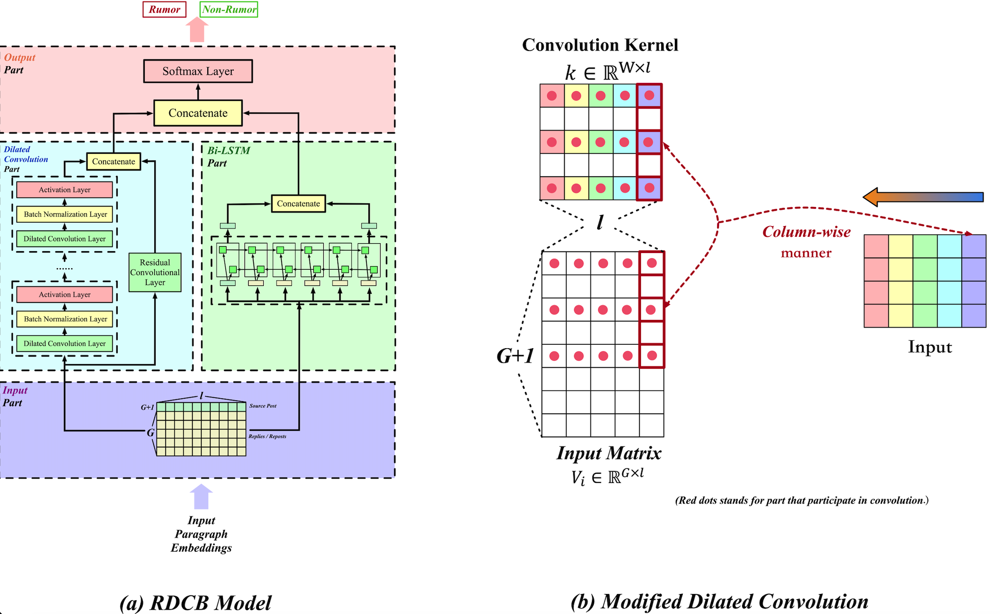
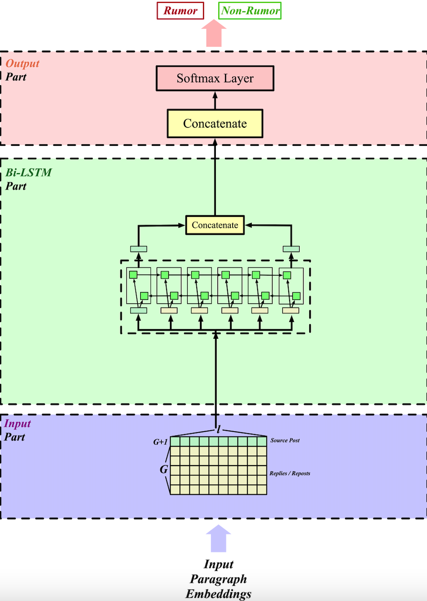
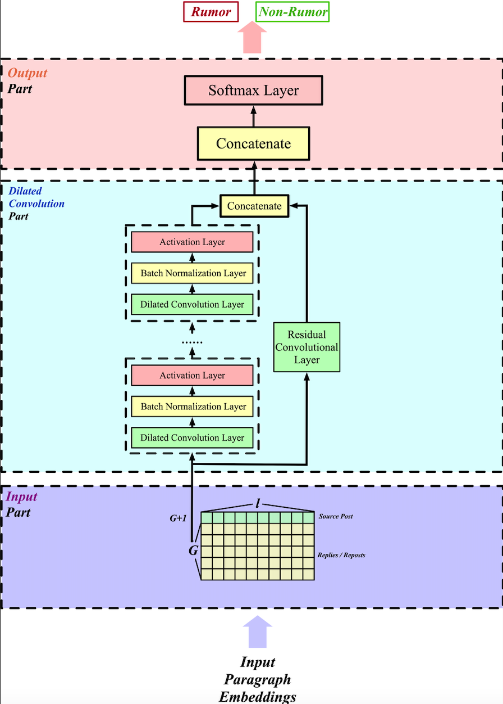

# Rumor-Detection-based-on-the-Cascading-Behavior
This repository contains source code and datasets for our paper "Repost or Reply？Rumor Detection based on Different Cascading Behaviors on Social Media" By Yue Yuan, Na Pang, Yuqi Zhang and Kan Liu. 

The trained models and two rumor datasets of this paper can be accessed here https://drive.google.com/drive/folders/109GpzxLnZdmyU9ny0e3Tc77RGXqrGy4m?usp=sharing.

# Requirements
python==3.6.5  
tensorflow==1.8.0  
gensim==3.8.3  
numpy==1.19.

# RDCB Models & Ablation Models
## RDCB Models
The overall structure of the RDCB model is shown in Figure 1.(a) that consists of four components: an input part, a dilated convolution part, a Bi-LSTM part, and an output part.

The dilated convolution part is intended to extract local features from the paragraph embeddings generated during the data processing phase. 
The original dilated convolution extracts meaningful text features through convolution on 2-D paragraph embeddings in the text splicing direction; however, convolution in the non-splicing direction loses spatial information of paragraph embedding. 
Hence, the original dilated convolution cannot meet the needs of local feature extraction from paragraph embeddings. 
We modify the convolution pattern of the original dilated convolution such that it can take paragraph embeddings as input and efficiently extract the local features from the input by stacking the dilated convolution layer. 
A detailed example of the this modified dilated convolution is shown in Figure 1.(b).

The Bi-LSTM part is intended to extract global text features from paragraph embeddings of repost or reply sequences. 
By capturing both the backward and forward directions of information from the input embedding sequence, the Bi-LSTM neural network extracts global sequence features from the input.

For the output part, the outputs of the dilated convolution part and Bi-LSTM part were concatenated and sent to the softmax layer for classification.
The softmax layer is built through a fully connected layer, and outputs the probability of a post being a rumor.
## Ablation Models
For the first ablation model (the RDCB without Dilated Convolution Part), the dilated convolutional neural network was removed from the main model so that the effect of local features of reposts or replies in rumor detection could be revealed. (Figure 2)

For the second ablation model (the RDCB without Bi-LSTM Part), the Bi-LSTM part of the RDCB model was removed from the main model to validate the global features of the reposts or replies in rumor detection. (Figure 3)

# How to use
## Dataset
The raw dataset is collected and processed by Yue Yuan and Na Pang and can be downloaded from [here](https://drive.google.com/drive/folders/109GpzxLnZdmyU9ny0e3Tc77RGXqrGy4m?usp=sharing).  
The raw datasets have been processed according to Section 3.2.1 Data prepraration and Section 3.2.2 Data processing in our paper and is stored in Data.rar.  
Therefore, you can use the data in Data.rar directly without performing the data prepraration process described in our paper. 
To use the data, unzip the Data.rar to the directory of this repository and enter corresponding dataset setting in console when running main.py.
For Twitter rumor Dataset:

--twitter --sourceposts     # source posts only-twitter rumor dataset combination

--twitter --sourceposts-replies     # source posts and replies-twitter rumor dataset combination

--twitter --sourceposts-reposts     # source posts and reposts-twitter rumor dataset combination

--twitter --sourceposts-replies-reposts     # source posts, replies, and reposts-twitter rumor dataset combination

For Weibo rumor Dataset:

--weibo --sourceposts     # source posts only-weibo rumor dataset combination

--weibo --sourceposts-replies     # source posts and replies-weibo rumor dataset combination

--weibo --sourceposts-reposts     # source posts and reposts-weibo rumor dataset combination

--weibo --sourceposts-replies-reposts     # source posts, replies, and reposts-weibo rumor dataset combination

## Model
The trained network models are stored in Models.rar and can be used directly for reproducing the experimental results in the paper.
To load the trained models, unzip the Models.rar to the directory of this repository and enter corresponding model settings in console when running main.py.
For Training:

--dbcn --train YOURPATH     # train the dbcn model, your trained model is defaultly saved in YOURPATH 

--bilstm --train YOURPATH     # train the bilstm model, your trained model is defaultly saved in YOURPATH 

--dbcnbilstm --train YOURPATH     # train the dbcnbilstm model, your trained model is defaultly saved in YOURPATH 

For Testing:

--dbcn --test --     #  test the dbcn model by our trained model   

--bilstm --test --     # test the bilstm model by our trained model  

--dbcnbilstm --test --     # test the dbcnbilstm model by our trained model  

## Example Command
Example 1. If you want to train the DBCN-BiLSTM model by your self using the twitter rumor dataset-source posts with replies combination, you should enter the following command on the console:

cd YOUR_REPOSITORY_PATH

python main.py --twitter --sourceposts-replies --dbcnbilstm --train YOURPATH

Following the above commands, your self trained models will be saved in YOURPATH.

Example 2. If you want to testin the trained DBCN-BiLSTM model provided by the author using the twitter rumor dataset-source posts with replies combination, you should enter the following command on the console:

cd YOUR_REPOSITORY_PATH

python main.py --twitter --sourceposts-replies --dbcnbilstm --test --

Following the above commands, you will reproduce the detection results in the paper.

Still updating！
Please keep tracking this repository!
